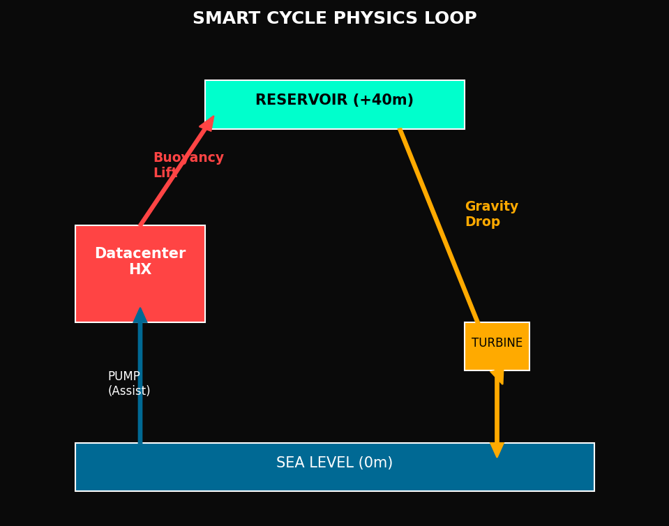

# Hydra-Cool Simulation Repository

> **"Can a Data Center become a Hydro-Electric Power Plant?"**
> A physics-based concept study of a buoyancy-driven massive cooling system.


*(Note: Assets are generated by the simulations)*

## Project Overview
Hydra-Cool is a proposed cooling architecture that utilizes:
1.  **Deep Sea Intake** (4°C) for direct cooling.
2.  **Thermal Buoyancy** (Hot water rising) to reduce pumping costs.
3.  **Gravity Return** to drive a hydro-turbine.

This repository contains rigorous Python simulations proving the physics, economics, and engineering feasibility of the system.

## Repository Structure

```
/Hydra-Cool
├── scenarios/                  # The Python Simulation Scripts
│   ├── A_physics/              # Buoyancy, Hydraulics, Thermodynamics
│   ├── B_comparison/           # PUE & Industry Benchmarking
│   ├── C_financial/            # CAPEX, OPEX, ROI, TCO
│   ├── D_risks/                # Water Hammer, Biofouling, Thermal Plume
│   ├── E_devil_advocate/       # Stress Tests & Market Analysis
│   └── F_future/               # Immersion Cooling & Scalability
│
├── assets/                     # Generated Charts & Visualizations
├── docs/                       # Technical Spec Sheets
│   ├── PHYSICS_BASIS.md
│   └── ASSUMPTIONS.md
│
└── STORY.md                    # The Narrative Description of the Project
```

## Key Findings

| Metric | Traditional Air Cooling | Hydra-Cool | Notes |
|--------|-------------------------|------------|-------|
| **PUE** | 1.55 | **1.01** | Near-zero cooling cost |
| **Op. Cost (100MW)** | $40.5M / yr | **$2.5M / yr** | 94% Savings |
| **CAPEX** | $20M | $44M | Payback in < 1 Year |
| **Eng. Risks** | Standard | Manageable | Water Hammer & Fouling solvable |

## Getting Started

### Prerequisites
- Python 3.8+
- `numpy`, `matplotlib`

### Running Simulations
You can run individual scenarios to generate their specific assets:

```bash
# Example: Run the Baseline Physics simulation
python3 scenarios/A_physics/A01_baseline_physics.py

# Example: Run the Financial TCO analysis
python3 scenarios/C_financial/C03_tco_20year.py
```

All output images are saved to the `assets/` directory.

## Phase Breakdown

- **Phase A (Physics):** Proves that buoyancy provides a real, measurable pressure boost (~12 kPa @ 100m) and identifies the system constraints.
- **Phase B (Comparison):** Benchmarks against Google/Microsoft standards.
- **Phase C (Financial):** Establishes the "No-Brainer" economic case.
- **Phase D (Engineering):** Validates pipe pressures, environmental impact, and material choices.
- **Phase E & F:** Stress tests the model and looks at future tech integration.

## License
MIT License.
