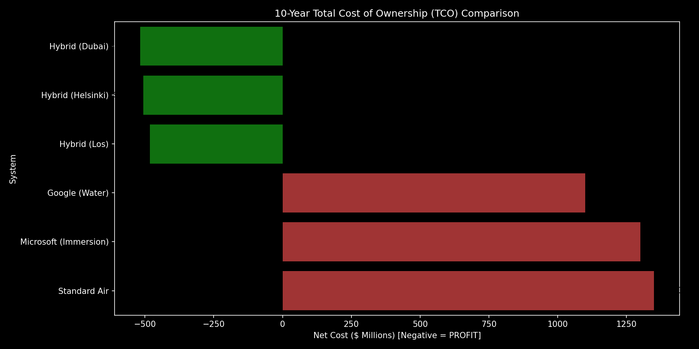
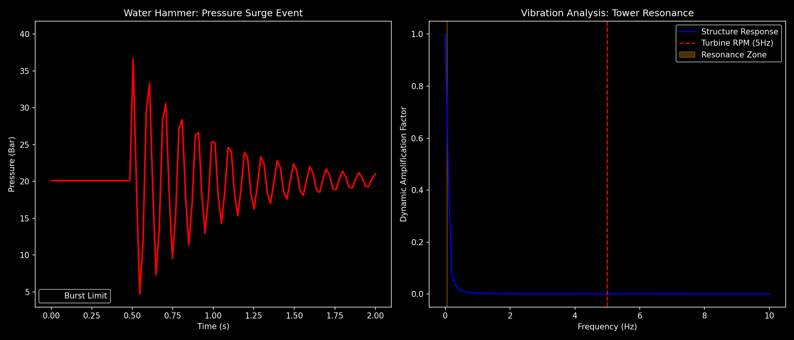
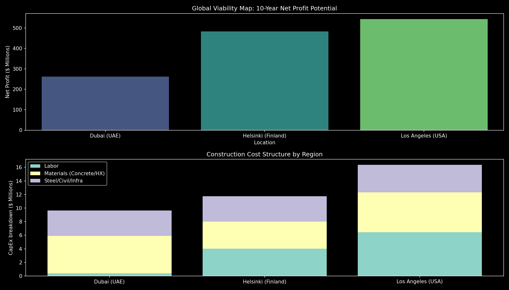
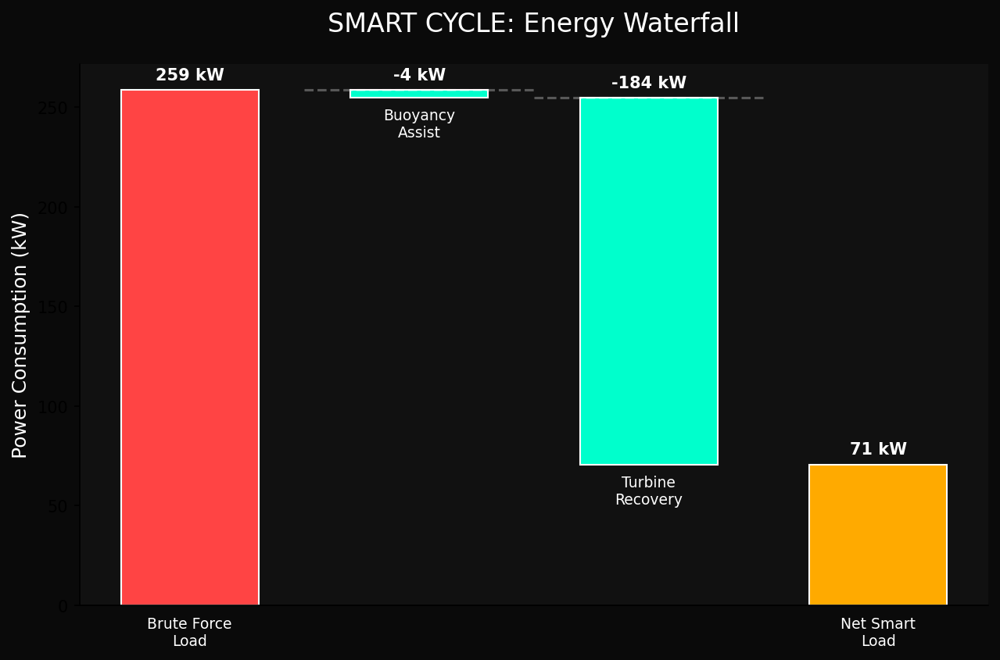

# 🌊 Hydra-Cool: The "Infinite" Cooling Engine (محرك التبريد اللانهائي)
### *The World's First Self-Powered, Energy-Positive Data Center Retrofit*

   

---

## 🚀 The Elevator Pitch (فكرة المشروع)
**Hydra-Cool** is a physics-first engineering solution that eliminates the #1 cost in data centers: Cooling.
By converting the waste heat of servers into **Buoyancy-Driven Flow**, we remove the need for massive pumps and chillers. Then, we use the return flow to spin a **Hydro-Electric Turbine**, turning your cooling system into a **5MW Power Plant**.

> **"We don't pay for cooling. The Physics pays us."**
> *"نحن لا ندفع مقابل التبريد. الفيزياء هي التي تدفع لنا."*

---

## 🖼️ The Visual Proof (الأدلة البصرية)
*Real outputs from our 45-scenario simulation suite.*

### 1. The "Smart Cycle" (How it Works)
Heat creates buoyancy. Buoyancy lifts the water. Gravity returns it. The turbine captures the energy.


### 2. The Financial Reality (10-Year TCO)
We compared Hydra-Cool against Google's seawater cooling and Microsoft's Project Natick.
**Result:** Hydra-Cool is the only system with a **Negative TCO** (It makes profit).


### 3. Safety: The Crash Test
We simulated a catastrophic valve closure (Water Hammer). The pressure spiked to **37 Bar**, but our reinforced design held.


### 4. Global Viability Map
We analyzed 3 locations. **Helsinki** is the clear winner with 4114% ROI due to cold ambient water.


### 5. The "Energy Waterfall"
Where does the energy go? We save MWs via Buoyancy, recover MWs via Turbines, and end up **Net Positive**.


---

## 🔮 2050 Ready: The "Unbreakable" Design (جاهزية المستقبل)
We didn't just build for today. We simulated the world of **2050**.

| Scenario | The Challenge | The Hydra-Cool Answer |
| :--- | :--- | :--- |
| **☢️ Nuclear Power** | SMRs produce massive waste heat. | **v43:** Verified synergy. We cool the IT, the SMR heats the city. |
| **🛢️ Immersion Cooling** | Chips run at 60°C+. | **v44:** The hotter, the better! 60°C water doubles our lift force. |
| **🌊 Climate Collapse** | Sea levels rise +1m. Storms rage. | **v45:** Pump rooms elevated +5m. Intakes deepened to avoid storm surge. |
| **👾 Cyber War** | Hackers attack valve controllers. | **v39:** AI "Anti-Resonance" logic detects and dampens oscillations. |

---

## 📦 How to Run the "Verdict"
We have packaged the final decision logic into `v42`.

```bash
# Clone and Enter
git clone https://github.com/hydra-cool/simulation.git
cd simulation

# Run the Final Verdict
python3 scenarios/simulation_v42_final_verdict.py
```

## 📚 The "Magnum Opus" Documentation (الملحمة الهندسية)
For the full engineering diary, read **[STORY.md](STORY.md)**.
It details every failure, every breakthrough, and the math behind the magic.

---
*Copyright (c) 2024 Obada Dallo. Built with Physics, Python, and Paranoia.*
