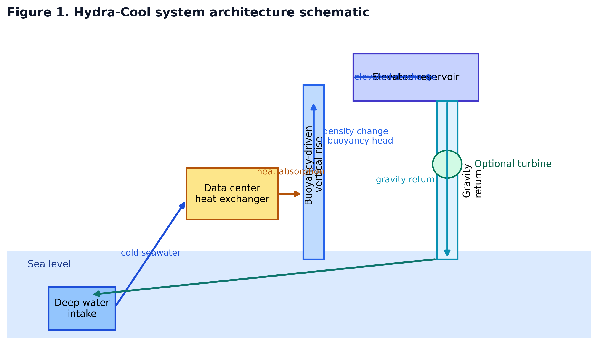
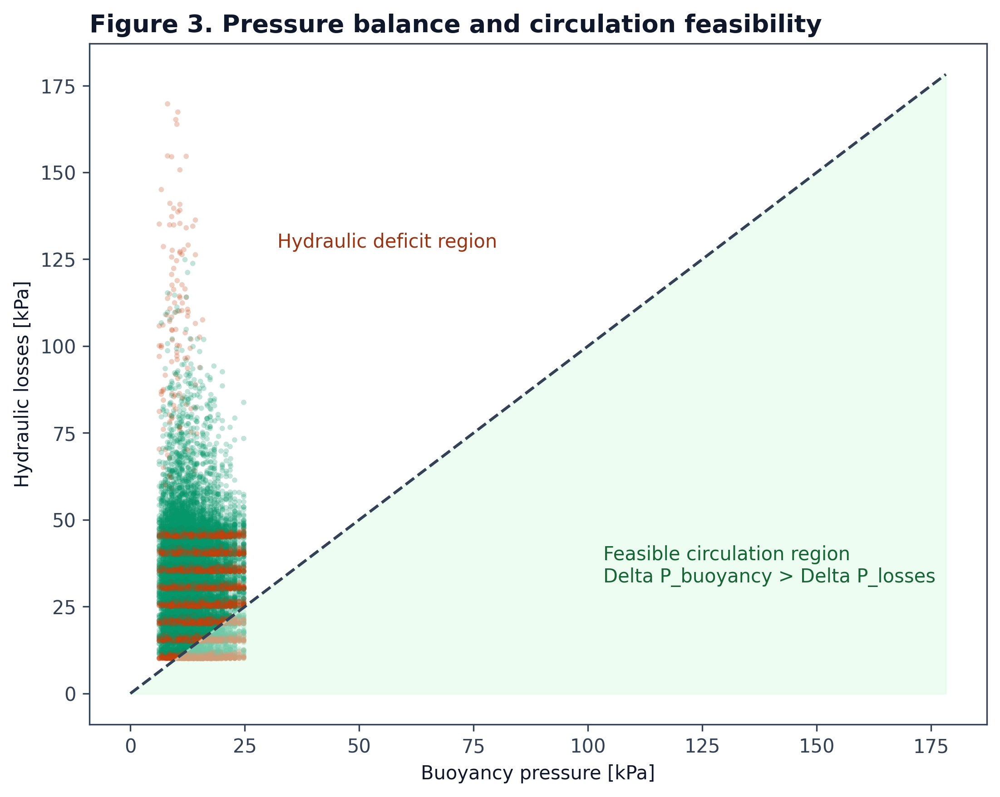
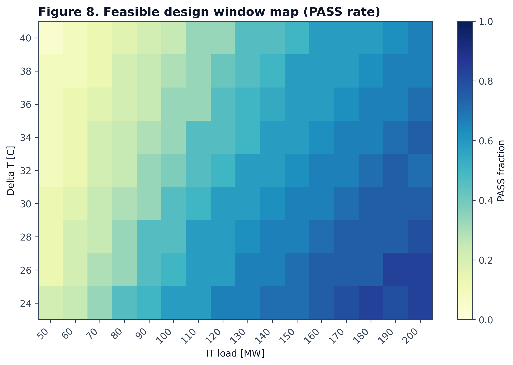
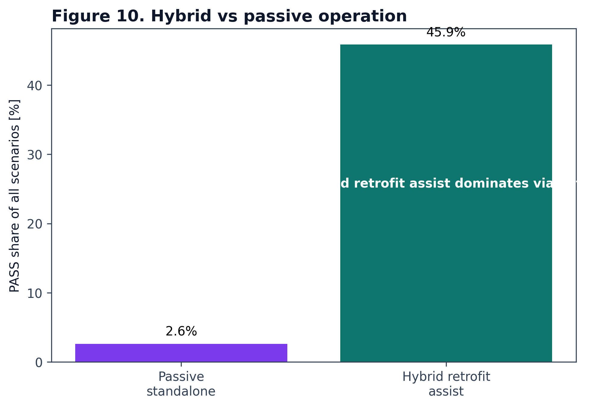

# Hydra-Cool Simulation Repository

> A buoyancy-assisted cooling research project for hyperscale data centers.



Hydra-Cool is a cooling architecture that combines:
1. **Deep seawater intake** for low-temperature heat rejection.
2. **Density-driven buoyancy assistance** to offset hydraulic work.
3. **Elevated discharge and gravity return** for loop closure.
4. **Optional micro-hydropower recovery** as a bonus layer rather than a core assumption.

The current research direction treats Hydra-Cool primarily as a **hybrid retrofit assist layer** for existing cooling plants, not as a strict standalone passive replacement.

**Concept origin:** Obada Dallo (2026)  
**Project type:** Hydra-Cool open engineering research project

## Repository Structure

```
/Hydra-Cool
├── scenarios/                  # The Python Simulation Scripts
│   ├── A_physics/              # Buoyancy, Hydraulics, Thermodynamics
│   ├── B_comparison/           # PUE & Industry Benchmarking
│   ├── C_financial/            # CAPEX, OPEX, ROI, TCO
│   ├── D_risks/                # Water Hammer, Biofouling, Thermal Plume
│   ├── E_devil_advocate/       # Stress Tests & Market Analysis
│   └── F_future/               # Immersion Cooling & Scalability
│
├── assets/                     # Legacy generated charts & visualizations
├── docs/                       # Technical Spec Sheets
│   ├── PHYSICS_BASIS.md
│   ├── ASSUMPTIONS.md
│   └── PUBLICATION_FIGURES.md
│
├── output/                     # Stage outputs, datasets, and publication figures
└── STORY.md                    # Narrative project description
```

## Key Findings

| Topic | Current reading | Interpretation |
|------|------------------|----------------|
| **Passive standalone mode** | Rare | Not the main viability path today |
| **Hybrid retrofit assist** | Dominant success mode | Best current development direction |
| **Main hydraulic failure** | Velocity too low | Flow sustainability is the core bottleneck |
| **Most important parameters** | IT load, HX drop, pipe count, pipe diameter, Delta T | These should drive design refinement |
| **Simulation campaign** | Stage-based screening + candidate pruning + focus window | Scenarios are now narrowed progressively instead of explored blindly |

## Verified Stage 3 Focus Window

The latest verified Phase 2 rerun of the focused design window reports:

- **PASS rate:** `48.50%`
- **Passive-only PASS rate:** `4.39%`
- **Hybrid retrofit-assist PASS rate:** `44.10%`
- **Dominant failure mode:** `INSUFFICIENT_VELOCITY`

This confirms the current scientific framing of Hydra-Cool as a **hybrid retrofit assist architecture first**, while retaining passive-natural circulation as a reportable but uncommon operating class.

## Latest Research Outputs

- **Draft manuscript:** `docs/MANUSCRIPT.md`
- **Journal-style manuscript:** `docs/JOURNAL_STYLE_MANUSCRIPT.md`
- **Submission-ready paper package:** `docs/paper_submission.md`
- **LaTeX manuscript package:** `docs/latex/`
- **Stage 1 screening:** `output/hydra_cool_stage_1_screening_summary.md`
- **Stage 2 candidate window:** `output/hydra_cool_stage_2_candidates_summary.md`
- **Stage 3 focused design window:** `output/hydra_cool_stage_3_focus_window_summary.md`
- **Publication figure set:** `output/publication_figures/`

## Citation

If you use Hydra-Cool in academic work, please cite:

```text
Dallo, O. (2026).
Hydra-Cool: Buoyancy-Assisted Seawater Retrofit Cooling and Feasible Design Windows for Hyperscale Data Centers.
Hydra-Cool Open Research Project.
GitHub: https://github.com/obadadallo95/Hydra-Cool
DOI: 10.5281/zenodo.18999303
```

Machine-readable citation metadata is available in `CITATION.cff`.

## DOI

Zenodo archival DOI for this release:

**10.5281/zenodo.18999303**

Zenodo record:
https://doi.org/10.5281/zenodo.18999303

## Publication Figures

Selected figures from the current research campaign:







For the complete figure board and captions, see [`docs/PUBLICATION_FIGURES.md`](docs/PUBLICATION_FIGURES.md).

## Getting Started

### Prerequisites
- Python 3.8+
- `numpy`, `matplotlib`

### Running Simulations
You can run individual scenarios to generate their specific assets:

```bash
# Example: Run the Baseline Physics simulation
python3 scenarios/A_physics/A01_baseline_physics.py

# Example: Run the Financial TCO analysis
python3 scenarios/C_financial/C03_tco_20year.py
```

All output images are saved to the `assets/` directory.

### Running the Stage-Based Study

```bash
python3 run_hyperscale_study.py
```

This generates:
- Stage 1 broad screening outputs
- Stage 2 pruned candidate outputs
- Stage 3 high-resolution focus-window outputs

### Generating Publication Figures

```bash
python3 scripts/generate_publication_figures.py
```

This exports PNG, SVG, and PDF figures to `output/publication_figures/`.

### Running Physics Validation Checks

```bash
python3 -m unittest tests/test_hydraulic_physics.py
```

## Phase Breakdown

- **Phase A (Physics):** Establishes buoyancy pressure, friction limits, and circulation constraints.
- **Phase B (Comparison):** Compares assisted cooling against legacy cooling energy demand.
- **Phase C (Stage Campaign):** Screens broad scenarios, prunes weak candidates, and maps the success window.
- **Phase D (Engineering):** Tracks hydraulic failure modes, velocity constraints, and retrofit feasibility.
- **Phase E & F:** Extend the concept toward scaling, deployment constraints, and future integration paths.

## License
MIT License.
