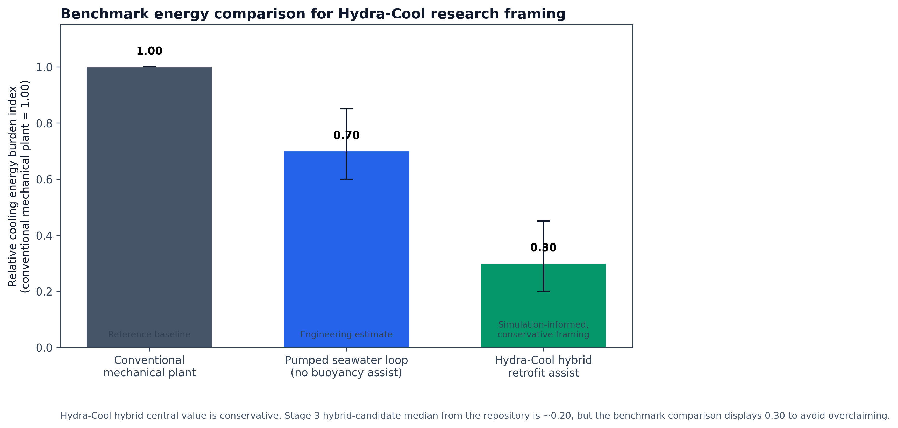
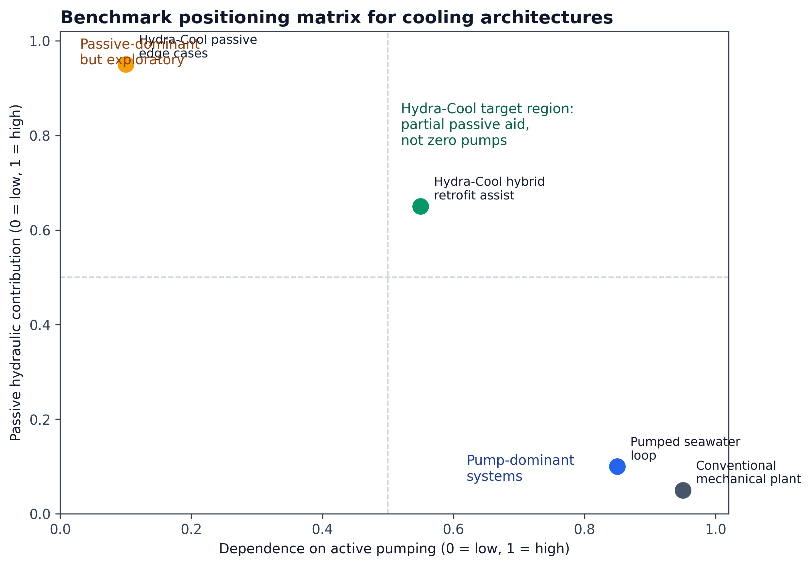
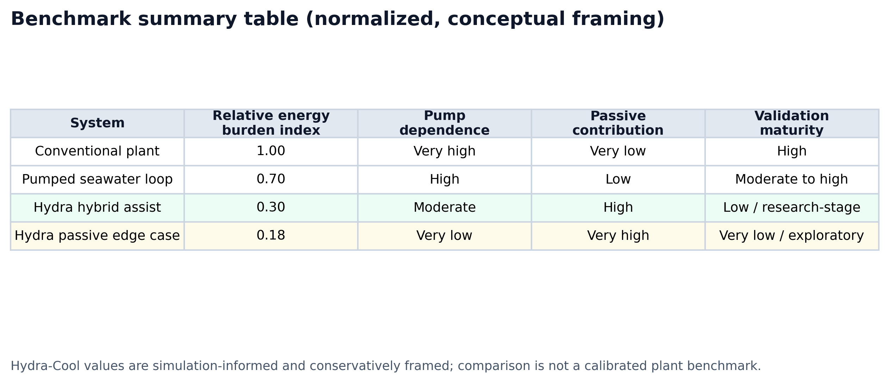

# Benchmark Comparison: Hydra-Cool Against Conventional and Seawater-Based Cooling Architectures

## A. Purpose of Comparison

Hydra-Cool now has a non-zero feasible design window in simulation, but research credibility requires more than reporting internal results alone. A benchmark comparison is therefore needed to place Hydra-Cool relative to more familiar cooling architectures. The goal of this section is not to claim industrial equivalence or deployment readiness. Instead, it provides a transparent positioning layer answering the question:

**How does Hydra-Cool compare, at a conceptual engineering level, to conventional and seawater-based alternatives?**

This benchmark is intentionally conservative. Where repository-calibrated benchmark plant data is not available, normalized engineering estimates are used and labeled explicitly.

## B. Reference Architectures

### 1. Conventional cooling tower / mechanically driven cooling plant

This benchmark represents a standard mechanically driven cooling architecture in which pumps, heat rejection equipment, and auxiliary systems are all actively powered. In the benchmark package, this architecture serves as the normalized reference baseline.

### 2. Pumped seawater loop without buoyancy assistance

This architecture represents a coastal water-side cooling loop that uses seawater as the heat sink but does not intentionally exploit buoyancy or gravity return as a material hydraulic-assist mechanism. It is included because it is the nearest plausible water-side alternative to Hydra-Cool without the buoyancy-assisted research concept layer.

### 3. Hydra-Cool hybrid retrofit assist

This is the primary Hydra-Cool operating mode supported by the current repository. In this mode, buoyancy and gravity provide partial hydraulic assistance, but pump support is still required. This is the dominant credible viability path in the Stage 3 focused design window.

### 4. Hydra-Cool passive-natural edge cases

These cases are included only for scientific completeness. They are uncommon, highly site-sensitive, and should not be presented as the default expected operating mode.

## C. Comparison Dimensions

The benchmark comparison evaluates the systems along the following dimensions:

- relative cooling energy burden
- pump dependence
- passive hydraulic contribution
- coastal water-side suitability
- expected hydraulic and integration complexity
- validation maturity
- expected feasibility window

## D. Benchmark Table

### Table 1. Primary benchmark framing table

| System | Evidence type | Relative cooling energy burden index* | Pump dependence | Hydraulic assistance | Water-side suitability | Expected complexity | Validation maturity |
|--------|---------------|----------------------------------------|-----------------|---------------------|------------------------|--------------------|--------------------|
| Conventional cooling tower / mechanical plant | Reference baseline | `1.00` | Very high | Very low | Generic, not coastal-specific | Mature but machinery-intensive | High |
| Pumped seawater loop without buoyancy assistance | Engineering estimate | `0.70` central, `0.60–0.85` range | High | Low | High at suitable coastal sites | High marine pumping and intake/discharge complexity | Moderate to high |
| Hydra-Cool hybrid retrofit assist | Stage 3 simulation output + conservative benchmark framing | `0.30` central, `0.20–0.45` range | Moderate | High partial passive contribution | High, but coastal and depth dependent | High integrated hydraulic complexity | Low / research-stage |
| Hydra-Cool passive-natural edge cases | Uncommon simulation edge-case framing | `0.18` central, `0.15–0.30` indicative range | Very low | Very high | Very site-specific | Very high design sensitivity | Very low / exploratory |

\*Normalized such that the conventional mechanically driven reference plant equals `1.00`.

### Table 2. Secondary relative positioning table

| System | Relative energy burden | Relative pumping demand | Passive contribution | Engineering maturity |
|--------|------------------------|-------------------------|---------------------|---------------------|
| Conventional cooling tower / mechanical plant | High | High | Very low | Commercially mature |
| Pumped seawater loop without buoyancy assistance | Moderate | High | Low | Site-dependent mature practice |
| Hydra-Cool hybrid retrofit assist | Low to moderate | Moderate | High | Research-stage concept |
| Hydra-Cool passive-natural edge cases | Low | Very low | Very high | Exploratory only |

## E. Interpretation

The benchmark positioning suggests that Hydra-Cool is most scientifically interesting not because it outperforms all alternatives by proof, but because it occupies a distinct middle ground between fully active marine cooling and purely passive natural circulation. Relative to a conventional mechanical plant, Hydra-Cool appears promising as a concept that could materially reduce hydraulic and cooling-energy burden in suitable coastal settings. Relative to a pumped seawater loop, its potential advantage is not merely access to seawater, but partial hydraulic assistance from buoyancy and gravity.

At the same time, the benchmark also clarifies where caution remains necessary. Conventional cooling plants are far more mature and better validated. Pumped seawater architectures already have stronger engineering precedent in suitable coastal contexts. Hydra-Cool therefore should currently be understood as a **simulation-based research concept with comparative promise**, not as a proven deployment substitute.

## F. Benchmark Limitations

This benchmark is intended as a positioning and framing device rather than a fully calibrated techno-economic comparison.

The limitations are important:

1. The conventional and pumped seawater benchmarks use normalized engineering estimates rather than plant-calibrated repository datasets.
2. Hydra-Cool benchmark values are informed by simulation outputs from the Stage 3 focused design window, which remain subject to baseline and auxiliary-load uncertainty.
3. The benchmark does not include site-specific bathymetry, civil works, permitting, controls, fouling, or lifecycle economic penalties.
4. The passive-natural Hydra-Cool cases are included only as uncommon edge cases and must not be read as the dominant deployment mode.

## Figures

### Benchmark energy comparison

### Benchmark positioning matrix

### Benchmark summary table

## Supporting Notes

- Benchmark assumptions: [benchmark_assumptions.md](benchmark_assumptions.md)
- Benchmark generation notes: [README_BENCHMARK_NOTES.md](README_BENCHMARK_NOTES.md)
