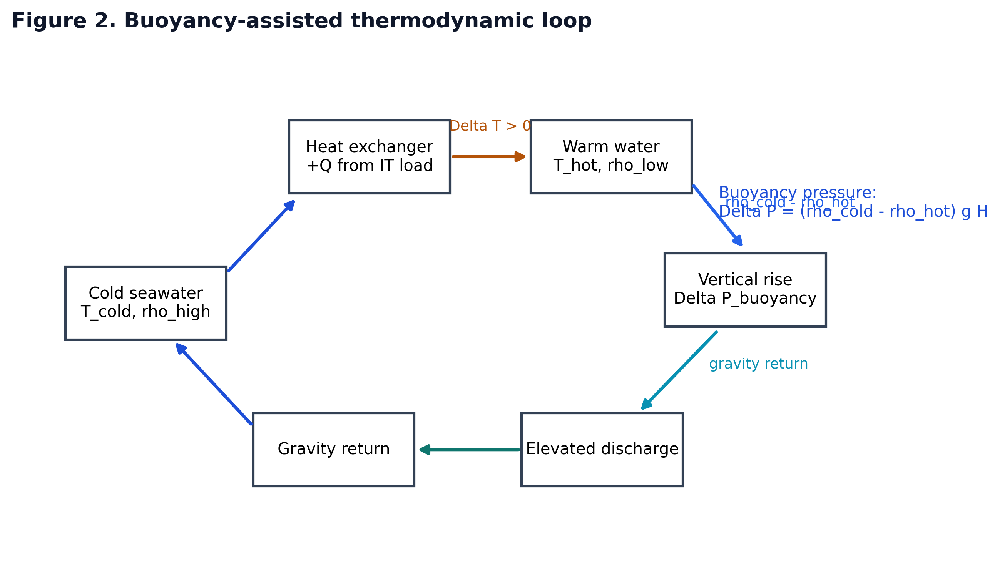
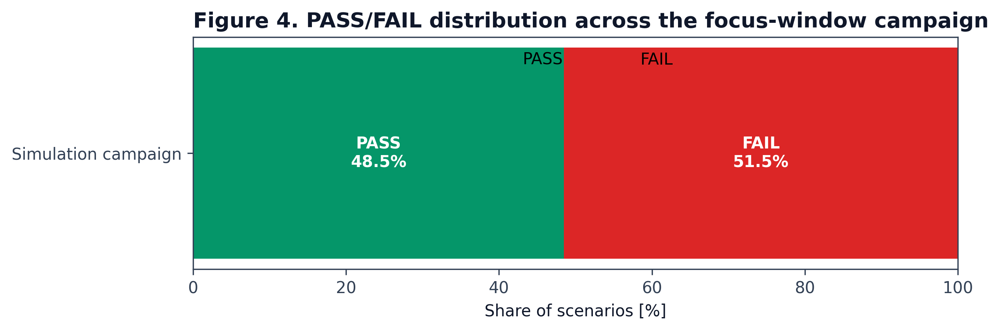
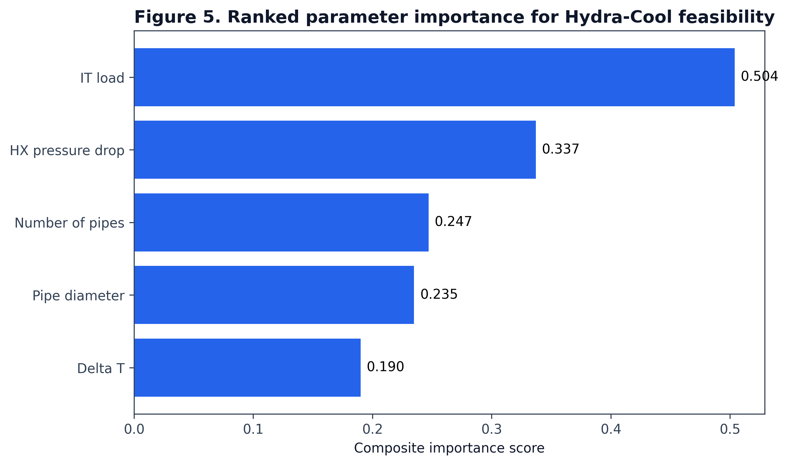
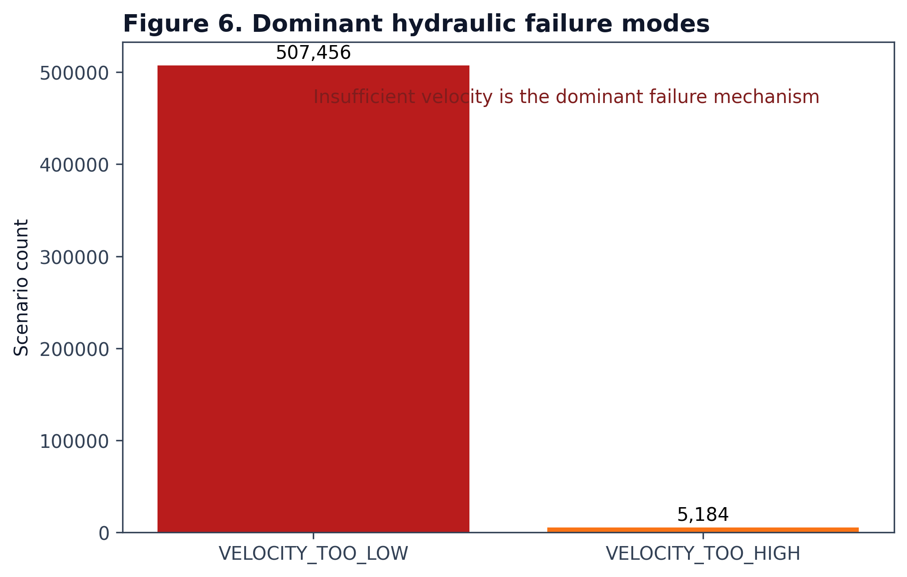
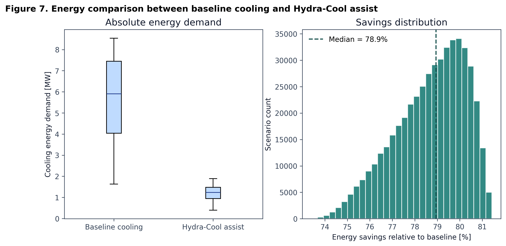
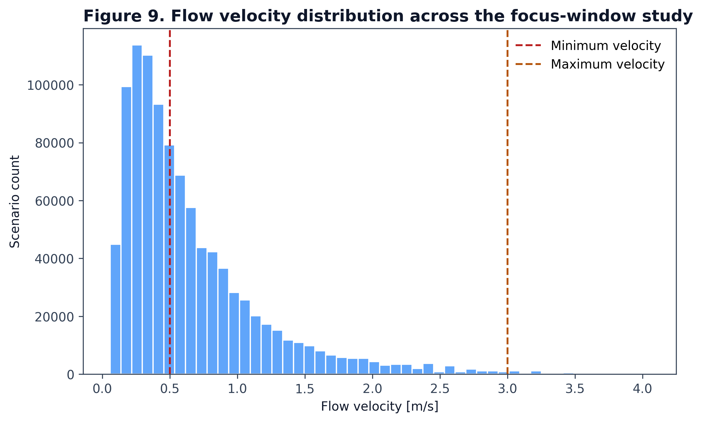

# Hydra-Cool Publication Figures

This page collects the current publication-grade figure set generated from the Stage 3 focused simulation campaign.

All source figures are available in:

- `output/publication_figures/*.png`
- `output/publication_figures/*.svg`
- `output/publication_figures/*.pdf`

## Figure 1. System Architecture Diagram

Engineering schematic of the Hydra-Cool architecture showing deep-water intake, data-center heat exchanger, buoyancy-driven riser, elevated reservoir, gravity return loop, and optional turbine placement.

## Figure 2. Buoyancy Flow Cycle

Thermodynamic circulation loop highlighting cold seawater intake, heat absorption, density reduction after heating, buoyancy-driven rise, elevated discharge, and gravity-assisted return.

## Figure 3. Pressure Balance Graph

Pressure-balance plot comparing buoyancy pressure and total hydraulic losses. Scenarios below the one-to-one line satisfy the pressure condition for circulation.

## Figure 4. PASS / FAIL Distribution

PASS/FAIL distribution across the focused simulation campaign. Approximately 48.5% of scenarios pass within the narrowed design window.

## Figure 5. Parameter Importance

Ranked sensitivity chart showing that IT load, heat-exchanger pressure drop, number of pipes, pipe diameter, and Delta T dominate Hydra-Cool feasibility.

## Figure 6. Failure Modes

Dominant hydraulic failure modes. Velocity that is too low is the primary reason for failure across the campaign, far exceeding high-velocity failure cases.

## Figure 7. Energy Comparison

Comparison between baseline cooling energy demand and Hydra-Cool assisted cooling demand, together with the resulting energy-savings distribution for viable scenarios.

## Figure 8. Design Window Map

Feasible design-window heatmap expressed as PASS fraction over Delta T and IT-load combinations, highlighting where retrofit viability is concentrated.

## Figure 9. Flow Velocity Distribution

Distribution of flow velocities with minimum and maximum design constraints marked, showing the large share of sub-threshold velocity cases.

## Figure 10. Hybrid vs Passive Operation

Comparison of passive-standalone and hybrid-retrofit operating modes. Hybrid retrofit assist accounts for the majority of viable scenarios.
